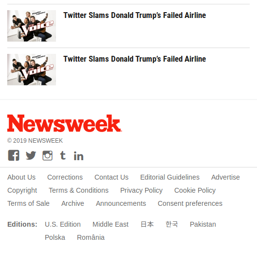

# PROJECT: USING BOOTSTRAP

This is the seventh project of the Main HTML/CSS curriculum at [Microverse](https://www.microverse.org/) - @microverseinc

* The objective is to try out Twitter’s Bootstrap framework by building a site that actually uses it – [Newsweek](https://www.newsweek.com/)

* The project was completed using html, css and bootstrap

#### [Assignment link](https://www.theodinproject.com/courses/html5-and-css3/lessons/using-bootstrap)

#### [Live link](https://bolabuari.com/newsweek-clone)

#### ScreenShot

### Large

### Small

##### Small Screen

  
 <b> Click here to view full page screenshot </b> 

##### Medium Screen (<992px)

  
 <b> Click here to view full screenshot </b> 

##### Large Screen (>991px)

  
 <b> Click here to view full page screenshot </b> 

#### Author

* [@bolah2009](https://github.com/bolah2009/)

#### Contact

* [Web](https://bolabuari.com/)  -  [Twitter](https://twitter.com/bolah2009)  -  [GitHub](https://github.com/bolah2009/)  -  [GitLab](https://gitlab.com/bolah2009/)  -  [LinkedIn](https://www.linkedin.com/in/bolah2009/)
